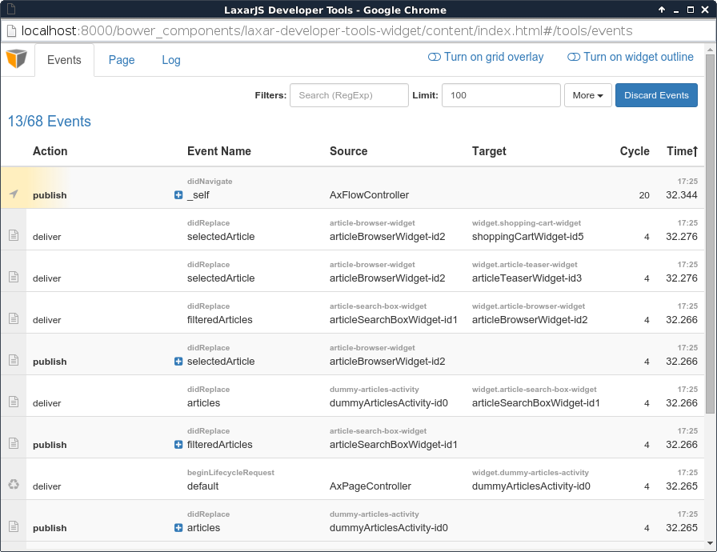
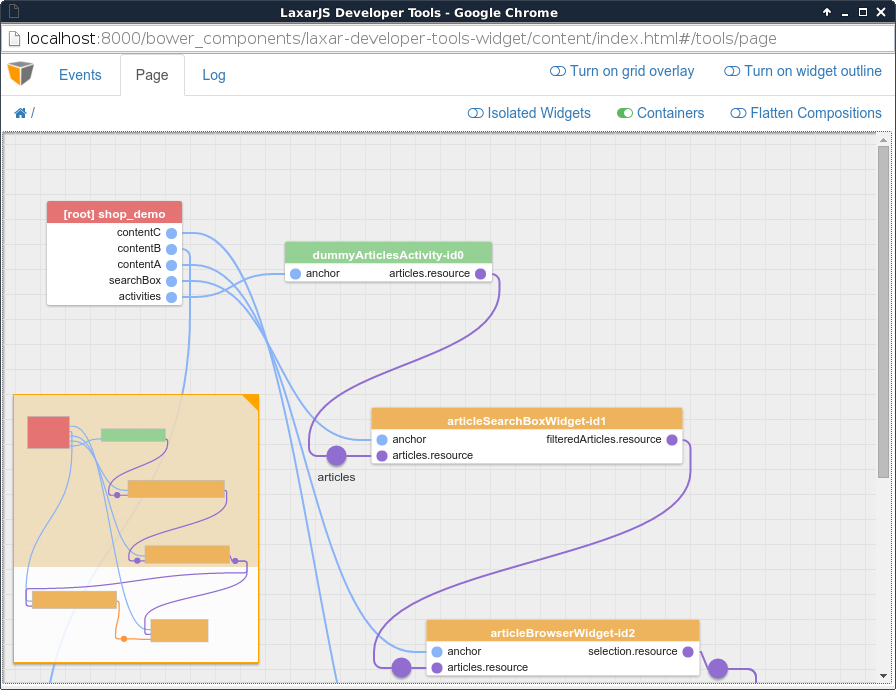

# laxar-developer-tools-content

This is an application using the LaxarJS developer tooling API.
The laxar-developer-tools-widget and the laxar-developer-tools-extension embed this application.

## Content

* [Appearance](#appearance)
* [Usage](#usage)
* [Features](#features)
* [Integration](#integration)
* [References](#references)

## Appearance

### Events tab

The events tab displays the latest publish/subscribe events of the currently running application, including subscribe/unsubscribe calls, as well as publication and delivery of events.
Events may be filtered by name, pattern, or source/target.

### Page tab

This "fusebox" view of the running application visualizes which widgets are connected through shared topics.
See [below](#usage) for more information on how to enable page inspection.

### Log tab

The log tab lists log messages that were created using the `laxar.log` API.
You can also use the browser console to inspect these messages without opening the developer tools.

