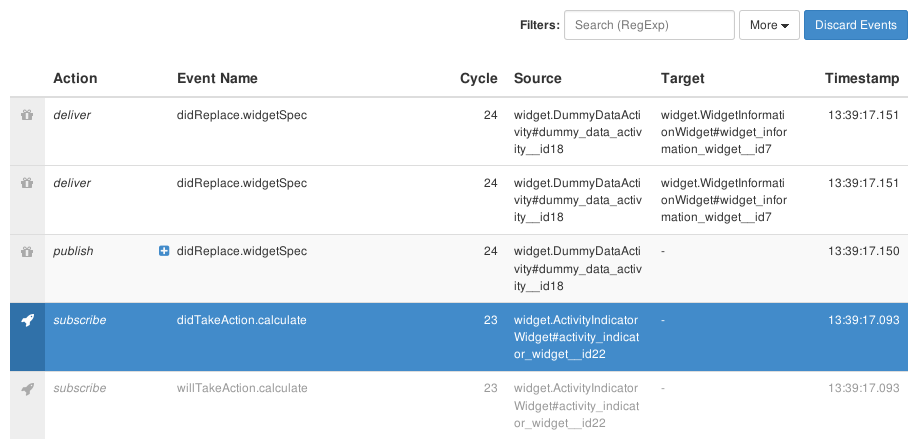

# EventsDisplayWidget

Shows a list of event bus interactions received through a stream of wrapper events, and allows to filter them.


## Content
* [Appearance](#appearance)
* [Usage](#usage)
* [Features](#features)
* [Integration](#Integration)
* [References](#references)


## Appearance

The events display widget has comprehensive styling even when using the default theme.
Because it is only used for development, most of the time no theming is needed.



An AxEventsDisplayWidget with five event bus interactions.


## Usage

For widget prerequisites consult the [bower.json](bower.json).

### Configuration example

```json
{
   "widget": "developer-tools/ax-events-display-widget",
   "features": {
      "events": {
         "stream": "myEventStream"
      }
   }
}
```
The AxEventsDisplayWidget, configured read events from `didProduce.myEventStream` wrapper events.

For full configuration options refer to the [widget.json](widget.json).


## Features

### 1. Display Event Items _(events)_

*R1.1* The widget MUST subscribe to the configured meta-event _(eventsByEvent.eventName)_ to obtain event items for display.

*R1.2* Each event item MUST be represented as a table row, except if filtered out (see below).
An item models a single interaction with the event bus, initiated by a participant _(subscribe, publish, unsubscribe)_ or by the event bus _(deliver)_.

*R1.3* The widget MUST keep and display a limited number of events only _(the buffer)_.
The buffer size MUST be configurable.
When the maximum buffer size is exceeded, events received first MUST be discarded first.

*R1.4* The widget MUST offer the user to clear the buffer manually, removing all event rows from view.

*R1.5* The widget MUST allow for the user to select events rows, resulting in a highlighted representation.

*R1.6* When a row with interaction type _publish_ or _subscribe_ is highlighted, _related_ rows MUST be highlighted as well.
Related rows are rows that share the same _cycle, event name_ and _sender_.
This allows to quickly identify all deliveries for a given _publish_-interaction, and vice versa.

*R1.7* The widget MUST allow for the user to impose a _limit_ on the number of most recent events to display.
The lower bound for this limit MUST be zero, the upper bound MUST be the size of the event buffer (300 by default).
By default, the limit MUST be 100.


### 2. Allow to Filter Event Items _(filter)_

*R2.1* The widget MUST offer to filter events _by name_, using regular expressions.
Initially, no name filtering SHOULD be applied.

*R2.2* The widget MUST offer to filter events _by pattern_, using a group of toggle controls.
For this purpose, event rows are considered to belong to a pattern if their name contains a pattern-specific topic, such as `didReplace` for the _resource_-pattern.
The widget MUST support at least the standard event patterns for _visibility, i18n, flags, actions_ and _resources_.
Initially, all patterns except _visibility_ and _i18n_ SHOULD be included for display.

*R2.3* The widget MUST offer to filter events _by interaction type_, using a group of toggle controls.
The interaction types are _subscribe, publish, deliver_ and _unsubscribe._
Initially, the interaction types _subscribe_ and _unsubscribe_ should be hidden.

*R2.4* The widget MUST offer to filter events _by source type_, using a group of toggle controls.
The predefined sender types are _runtime_ and _widgets_ to distinguish events sent by the LaxarJS runtime from widget-sent events.


###  3. Allow to show local events _(showLocalEvents)_

## Integration

### Patterns
The widget does not support any standard event patterns.
Together with other developer-tools widgets it uses the non-standard `didProduce.*` event stream protocol.


## References
The following resources are useful or necessary for the understanding of this document.
The links refer to the latest version of the documentation.
Refer to the bower.json for the specific version that is normative for this document.

* [LaxarJS Concepts](https://github.com/LaxarJS/laxar/blob/master/docs/concepts.md)
* [LaxarJS Manuals: Events and Publish-Subscribe](https://github.com/LaxarJS/laxar/blob/master/docs/manuals/events.md)
